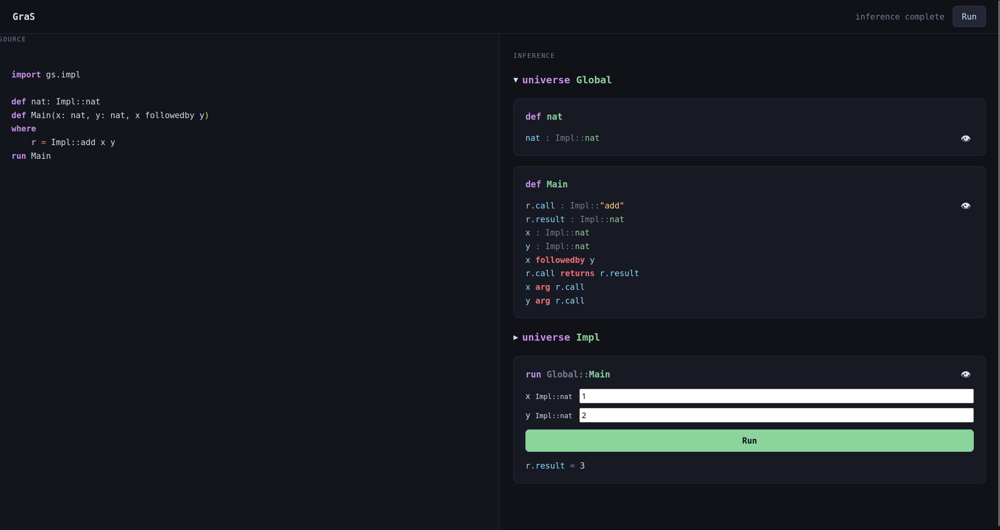

# GraS

*A language for graph substitutions.*

**Author: Emmanouil Krasanakis**

*Disclaimer: The code has mostly been written by ChatGPT, with manual review, refinement, and testing. This is a re-implementation of the most significan parts of my PhD thesis some years after its conclusion. he rewrite helps frame obscure theoretical results and tools in simpler terms.*


GS is a language for proofs using labeled graph 
substitutions; variables are nodes, and named relations 
are labeled directed edges. There are subistitution rules 
for "proving" programs, where the proof may also translate
to creating a runable pipeline. Do note that the proofs
are logically consistent despite allowing abstract textual
predicates in their definitions.

## 🚀 Quickstert

Clone this repository and run  `python gs.py --serve` to pen the interactive environment. Start writing your program.



## 📚 Short guide

### Universes

A universe is a namespace whose types can be accessed
via `::`. You can skip the namespace access if already
inside it. Below is an example, which also shows
how import can port namespaces from other *.gs* files.
By default, your file is in the `Global` namespace.

```python
import gs.impl // contains the Impl namespace too

universe Myuniverse
def nat: Impl::nat
```


### Types

A def declares a graph. Commas and parentheses are optional,
but do prefer them when annotating in one line. The example
declares two fields *x,y*, which would be unpacked into their
sub-components if they were of more complicated type. But here
they are just of a base def `nat`. The last def argument 
is how to create a labeled directed relation. Use `!` in front
of the label to prevents a graph matching when the corresponding 
relations exist.

```python
import gs.impl
def nat: impl::nat // redeclare in this universe
def pair(x: nat, y: nat, x followedby y)
```

### Return

`return` turns a def a function and declares its returned graph.
More details later, but importantly any inputs not found in the 
outputs are DROPPED. By the way, variables unpack to their type's
internals immediately. That is, `p: pair` unpacks into 
`p.x: nat, p.y: nat, p.x followedby p.y`. Convesely, could use
`p` to also gather all variables starting with `p.`. This intentionally
looks and behaves similarly to structure access of other languages.

```python
def keep_left(p: pair)
return
    p.a: nat
```

The returned graph is separate from the input graph. Relations 
declared only in `return` belong only to the return graph. 
Can use parentheses and commas similarly to before too. At the
same time, the returned graph constitutes the function's type,
for example to reference types via the names of their constructors.

**Returned node are NOT automatically preserved from the input graph.** That is, you will need to redeclare nodes that you want to keep.
Relations are not automatically preserved either, but this rarely
matters in envisioned use cases.

There is also a `where` block for types, in which def inference
and input-output wiring can take place. For example, this is
valid:

```python
def keep_left(p: pair)
return ret: nat
where ret=p.x
```


### Where

`where` merges nodes between inputs and/or outputs, and
uses functions to transform the input graph. It comprises
several statements that may remove variable nodes by
making graph subsitutions via functions. THe result may
be stored on newly created or returned variables. Here is
an example, where `run main` just lets us run the type
as a program. 

Remaining inputs (plus new ones gnerated)
become runtime inputs. Function calls are graph
substitution operations, where the nodes of the
replacing subgraph (the one that has just been
used to replace the subgraph matching function
inputs) are stored on one variable. The result
is then unified with the assigned name, to be
easily referenced.

```python
import gs.impl
universe Impl // directly reuse the types
def Main(x: nat, y: nat)
where
    r = add x y
    ret = sub r y
run main
```

Functions substitutes subgraphs with one of the same node types
and a compatible subset of edges. This is the exact mechanism:
1. Match the nodes in the program's graph.
2. Match a subset of edges of the induced program subgraph for matched nodes.
3. Replace the induced subgraph with the substitution rule's outcome. This will partially match some inputs with some outputs, but may remove some nodes too (nodes and edges are consumed linearly by rule application).
4. Remove all dangling disconnected subgraphs due to removed nodes.
5. Reinstate relations between output nodes that are isomorhpic to those of the original induced subgraph but have *not* been considered by the input graph.

Parentheses create temporary substitutions automatically. The next example
is equivalent to creating a temporary for `add x y` and passing
that result to `mul`. Use `reduce` instead of `ret=` to not track
the return with a variable. Newlines and commas end expressions
(unless within a parenthesis.)

```python
ret = mul (add x y) factor
```

`reduce all` automatiically searches and performs all
available function applications.

```python
import gs.impl
import gs.implopt

def nat: Impl::nat
def Main(x: nat, y: nat, x followedby y)
where
    ret = Impl::sub (Impl::add x y) y
    reduce all Implopt::merge_add
    reduce all Implopt::optimization_addsub

run Main
```

A function can merge nodes through the following pattern:

```python
def assert_equal(a: nat, b:nat)
return(a: nat, b: nat)
where a = b
```

### Builtins

*Unorganized concepts about creating new builtin functions.*

A function is a def with a return graph.
String types such as `"add"` identify implementation call nodes.

```python
def add(a: nat, b: nat)
return
    call: "add"
    a: nat
    b: nat
    result: nat
    call returns result
    a arg call
    b arg call
```

`arg` relations represent a variadic argument route.
Use `arg0`, `arg1`, etc. for fixed-position arguments.
Calls implement either of those schema.

``` text
a arg0 call
b arg1 call
```


### Keyword summary

The language recognizes the following keywords.

```text
import
universe
def
return
where
run
reduce
all
```
